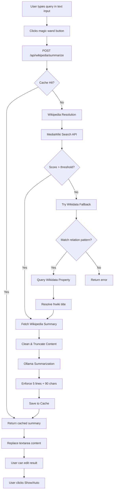

# Wikipedia + Ollama Summarization Feature

## Architecture Overview




## 1. UI/UX Flow

### LowerThirdCard Enhancement

**File**: [`components/dashboard/cards/LowerThirdCard.tsx`](components/dashboard/cards/LowerThirdCard.tsx)**No new mode needed** - enhance existing "text" mode:Add a **magic wand button** (✨ `Wand2` icon from lucide-react) next to the existing text/markdown textarea input.**Button behavior**:

- Only enabled when text mode is active and input has content (min 2 chars)
- Click triggers Wikipedia lookup + AI summarization
- Result **replaces** the textarea content with the 5-line summary
- User can then edit the result before clicking "Show" or "Auto"

**States**:

- **idle**: Magic wand button enabled (if input has text)
- **loading**: 
- Magic wand button shows `Loader2` spinner icon with spin animation
- Button disabled
- Textarea disabled (to prevent changes during processing)
- Progress toast messages ("Searching Wikipedia...", "Summarizing with AI...")
- **success**: 
- Textarea populated with summary (5 lines, line breaks preserved)
- Brief success toast: "✓ Wikipedia summary ready - edit and click Show"
- User can edit as normal
- **error**: 
- Error toast with specific message (not found, timeout, rate limit, etc.)
- Original query text preserved in textarea
- Retry button in toast

**No changes to existing text mode functionality** - all current features (Show, Hide, Auto, side selection, image upload) work the same

## 2. Wikipedia Resolution Service

### New Service: WikipediaResolverService

**File**: `lib/services/WikipediaResolverService.ts`**Dependencies**:

- `npm install wikipedia` ([docs](https://www.npmjs.com/package/wikipedia))
- `npm install wikibase-sdk` ([docs](https://github.com/maxlath/wikibase-sdk))

**Method**: `resolveAndFetch(query: string): Promise<{ title: string; extract: string; thumbnail?: string; source: 'direct' | 'wikidata' }>`**Step A - Direct Wikipedia Search** (using `wikipedia` npm package):

```typescript
import wikipedia from 'wikipedia';

wikipedia.setLang('fr');

try {
  // Search for page
  const searchResults = await wikipedia.search(query);
  
  if (searchResults.results.length === 0) {
    // No results, try Wikidata fallback
    return await wikidataFallback(query);
  }
  
  // Get top result summary
  const page = await wikipedia.page(searchResults.results[0].title);
  const summary = await page.summary();
  
  return {
    title: summary.title,
    extract: summary.extract,
    thumbnail: summary.thumbnail?.source,
    source: 'direct'
  };
} catch (error) {
  // Try Wikidata fallback
  return await wikidataFallback(query);
}
```

**Step B - Wikidata Fallback** (using `wikibase-sdk`):Pattern detection (French regex):

- `capitale de (.+)` → Wikidata property P36 (capital)
- `président de (.+)` → P35 (head of state)
- `population de (.+)` → P1082 (population)
- `superficie de (.+)` → P2046 (area)
- `monnaie de (.+)` → P38 (currency)
- `langue de (.+)` → P37 (official language)
```typescript
import wdk from 'wikibase-sdk/wikidata.org';

// Detect pattern and extract entity
const pattern = detectPattern(query); // e.g., { type: 'capitale', entity: 'Kenya' }

// Build SPARQL query
const sparql = `
  SELECT ?item ?itemLabel WHERE {
    ?country rdfs:label "${pattern.entity}"@fr .
    ?country wdt:${pattern.property} ?item .
    SERVICE wikibase:label { bd:serviceParam wikibase:language "fr" }
  } LIMIT 1
`;

const url = wdk.sparqlQuery(sparql);
const response = await fetch(url);
const data = await response.json();
const results = wdk.simplify.sparqlResults(data);

if (results.length > 0) {
  const capitalName = results[0].itemLabel;
  // Recursively fetch Wikipedia summary for capital
  return await resolveAndFetch(capitalName);
}
```


**Error handling**:

- No results from Wikipedia or Wikidata → throw `WikipediaNotFoundError`
- Pattern not recognized → throw `WikipediaAmbiguousError`
- Network timeout (5s) → throw `WikipediaTimeoutError`

**Content cleaning** (before LLM):

- Strip citations `[1]`, `[citation needed]`
- Remove special chars that could cause injection
- Normalize whitespace
- Truncate to 800 chars (reduce token usage)

## 4. Ollama Summarization Service

### New Service: OllamaSummarizerService

**File**: `lib/services/OllamaSummarizerService.ts`**Configuration**:

- Model: `mistral:latest` (default, configurable)
- `num_ctx`: 2048 (suitable for 16GB Mac)
- `temperature`: 0.3 (deterministic)
- `timeout`: 30s

**Connection config sources** (order of precedence):

1. Settings page UI override (`settings.ollama_url`)
2. Environment variables (`.env`): `OLLAMA_URL=http://localhost:11434`
3. Default: `http://localhost:11434`

**Prompt template**:

```javascript
Résume ce texte en EXACTEMENT 1 à 5 lignes MAXIMUM.
Chaque ligne doit faire MAXIMUM 90 caractères.
Format : texte brut uniquement, PAS de puces, PAS de markdown.

Texte : {cleaned_extract}
```

**Injection prevention**:

- Escape user input before LLM
- Strip `{`, `}`, `<`, `>` from content
- Validate output format (reject if contains markdown bullets, `*`, `-`, `#`)

**Method**: `summarize(content: string): Promise<string[]>` → returns array of lines (1-5)

## 5. Post-Processing & Validation

**File**: `lib/utils/textProcessing.ts`**Function**: `enforceLineLimits(text: string): string[]`Rules:

- Split by newlines
- If > 5 lines: keep first 5
- For each line > 90 chars: wrap at 90 with ellipsis ("...")
- Remove empty lines
- If < 1 line after processing: throw `InvalidSummaryError`

**Function**: `sanitizeForOverlay(lines: string[]): string[]`

- Remove special chars that break rendering
- HTML entity encoding
- Normalize quotes, apostrophes

## 6. Cache Service

### New Service: WikipediaCacheService

**File**: `lib/services/WikipediaCacheService.ts`**Two-tier cache**:**In-memory (hot cache)**:

- LRU cache, max 100 entries
- Key: `{query}:{lang}` (e.g., `lion:fr`)
- Value: `{ summary: string[], thumbnail?: string, timestamp: number }`

**SQLite persistence**:

- New table: `wikipedia_cache`
- `id`: UUID primary key
- `query`: TEXT indexed
- `lang`: TEXT (default 'fr')
- `title`: TEXT (resolved canonical title)
- `summary`: TEXT (JSON array of lines)
- `thumbnail`: TEXT nullable
- `source`: TEXT ('direct' or 'wikidata')
- `created_at`: INTEGER (unix timestamp)
- `ttl`: INTEGER (seconds, default 604800 = 7 days)

**Methods**:

- `get(query: string): Promise<CachedResult | null>`
- Check in-memory first
- Check SQLite if miss
- Load into memory if found
- Validate TTL (return null if expired)
- `set(query: string, result: CachedResult): Promise<void>`
- Save to both memory + SQLite
- `invalidate(query: string): Promise<void>`
- Remove from both
- `cleanup(): Promise<number>` (cron job)
- Delete expired entries (TTL exceeded)

## 7. Rate Limiting

**File**: `lib/services/RateLimiterService.ts` (reusable)**Strategy**: Token bucket per IP/session

- Wikipedia API: 10 requests/minute
- Ollama API: 5 requests/minute
- Implemented via in-memory Map: `{ [key: string]: { tokens: number, lastRefill: number } }`

**Method**: `checkLimit(key: string, limit: number, window: number): boolean`**Integration**: Middleware in API route checks rate limit before processing

## 8. API Route

### New Route: POST /api/wikipedia/summarize

**File**: `app/api/wikipedia/summarize/route.ts`**Request body**:

```typescript
{
  query: string;
  forceRefresh?: boolean; // bypass cache
}
```

**Response**:

```typescript
{
  success: true;
  data: {
    query: string;
    title: string; // canonical Wikipedia title
    summary: string[]; // 1-5 lines
    thumbnail?: string;
    source: 'direct' | 'wikidata' | 'cache';
    cached: boolean;
  }
} | {
  success: false;
  error: string;
  code: 'NOT_FOUND' | 'AMBIGUOUS' | 'TIMEOUT' | 'RATE_LIMIT' | 'LLM_ERROR';
}
```

**Flow**:

1. Validate request (Zod schema)
2. Check rate limit → 429 if exceeded
3. Check cache (unless `forceRefresh`)
4. Resolve Wikipedia title (WikipediaResolverService)
5. Fetch summary content
6. Summarize with Ollama
7. Post-process lines
8. Save to cache
9. Return result

**Error handling**:

- Specific error codes for each failure type
- Log metrics (resolution path, cache hit, error type)

## 9. Settings Page Integration

### Update Settings Page

**File**: `app/settings/integrations/page.tsx` (or create new)**New section**: "Ollama Configuration"

- Input: Ollama URL (default: http://localhost:11434)
- Select: Model (dropdown: mistral:latest, llama2, etc.)
- Input: num_ctx (default: 2048)
- Test connection button (calls `/api/ollama/test`)

**Database schema update**:Add columns to `settings` table:

- `ollama_url`: TEXT
- `ollama_model`: TEXT
- `ollama_num_ctx`: INTEGER

## 10. Logging & Metrics

**Logger integration**: Use existing `Logger` service**Log events**:

- `wikipedia.resolution.direct` - successful direct Wikipedia search
- `wikipedia.resolution.wikidata` - fallback to Wikidata
- `wikipedia.cache.hit` - cache hit
- `wikipedia.cache.miss` - cache miss
- `wikipedia.error.not_found` - no results
- `wikipedia.error.timeout` - API timeout
- `ollama.summary.success` - successful summarization
- `ollama.summary.error` - LLM error

**Metrics to track**:

- Resolution path distribution (direct vs Wikidata)
- Cache hit rate
- Average response time
- Error rate by type
- Most queried topics

## 11. Test Cases

**Unit tests** (`__tests__/services/`):

- `WikipediaResolverService.test.ts`:
- Exact match resolution
- Ambiguous query handling
- Relational query detection (capitale de France)
- Wikidata fallback success/failure
- Timeout handling
- `OllamaSummarizerService.test.ts`:
- Valid summarization (1-5 lines)
- Line length enforcement
- Injection attempt sanitization
- Timeout handling
- `WikipediaCacheService.test.ts`:
- Cache hit/miss
- TTL expiration
- Memory + SQLite sync

**Integration tests** (`__tests__/integration/`):

- `wikipedia-summarize-api.test.ts`:
- E2E happy path (lion → summary)
- Relational query (capitale du Kenya → Nairobi)
- Ambiguous query (article)
- Rate limit enforcement
- Cache reuse

**Functional tests** (`scripts/test-wikipedia-functional.js`):

- Real Wikipedia + Ollama calls
- Manual verification of summary quality
- Edge cases: Unicode, special chars, very long titles

## 12. Security Checklist

- [ ] Input validation (Zod schema, max length)
- [ ] Rate limiting per IP/session
- [ ] External API timeout enforcement
- [ ] Content sanitization before LLM
- [ ] Output validation (reject markdown/bullets)
- [ ] HTML encoding for overlay display
- [ ] Cache poisoning prevention (hash query keys)
- [ ] CORS headers on API routes
- [ ] Error messages don't leak internals

## File Changes Summary

**New files**:

- `lib/services/WikipediaResolverService.ts` (~150 lines, simplified with npm packages)
- `lib/services/OllamaSummarizerService.ts` (~150 lines)
- `lib/services/WikipediaCacheService.ts` (~200 lines)
- `lib/services/RateLimiterService.ts` (~80 lines)
- `lib/models/Wikipedia.ts` (Zod schemas, ~60 lines)
- `lib/utils/textProcessing.ts` (~100 lines)
- `app/api/wikipedia/summarize/route.ts` (~120 lines)
- `app/api/ollama/test/route.ts` (~40 lines)
- `__tests__/services/WikipediaResolverService.test.ts` (~150 lines)
- `__tests__/services/OllamaSummarizerService.test.ts` (~150 lines)
- `__tests__/services/WikipediaCacheService.test.ts` (~120 lines)
- `__tests__/integration/wikipedia-summarize-api.test.ts` (~180 lines)
- `scripts/test-wikipedia-functional.js` (~100 lines)

**Modified files**:

- [`components/dashboard/cards/LowerThirdCard.tsx`](components/dashboard/cards/LowerThirdCard.tsx): Add "wiki" mode tab, query input, preview editor (~150 lines added)
- [`lib/services/DatabaseService.ts`](lib/services/DatabaseService.ts): Add `wikipedia_cache` table schema (~20 lines)
- `app/settings/integrations/page.tsx`: Add Ollama config section (~80 lines)
- `.env.example`: Add `OLLAMA_URL`, `OLLAMA_MODEL` (~2 lines)

**Dependencies to add**:

```bash
pnpm add wikipedia wikibase-sdk
```


- `wikipedia` - [npm package](https://www.npmjs.com/package/wikipedia) for easy Wikipedia API access
- `wikibase-sdk` - [GitHub](https://github.com/maxlath/wikibase-sdk) for Wikidata SPARQL queries and result simplification

## Implementation Order

1. **Setup**: Install npm dependencies (`wikipedia`, `wikibase-sdk`), database schema, models, Zod schemas
2. **Core services**: WikipediaResolverService (with npm packages), OllamaSummarizerService
3. **Infrastructure**: Cache service, rate limiter
4. **API route**: `/api/wikipedia/summarize`
5. **UI integration**: Magic wand button in LowerThirdCard text mode
6. **Settings page**: Ollama configuration UI
7. **Tests**: Unit → Integration → Functional
8. **Refinement**: Error handling, logging, metrics

## Key Benefits of Using NPM Packages

**`wikipedia` package**:

- ✅ Handles MediaWiki API complexity
- ✅ Built-in retry logic and error handling
- ✅ Automatically gets summary + thumbnail
- ✅ Language switching (`wikipedia.setLang('fr')`)
- ✅ Well-maintained with 200k+ weekly downloads

**`wikibase-sdk` package**:

- ✅ SPARQL query builder helpers
- ✅ Result simplification (complex Wikidata JSON → simple objects)
- ✅ URL generation for Wikidata APIs
- ✅ Battle-tested by Wikidata community
- ✅ TypeScript definitions included