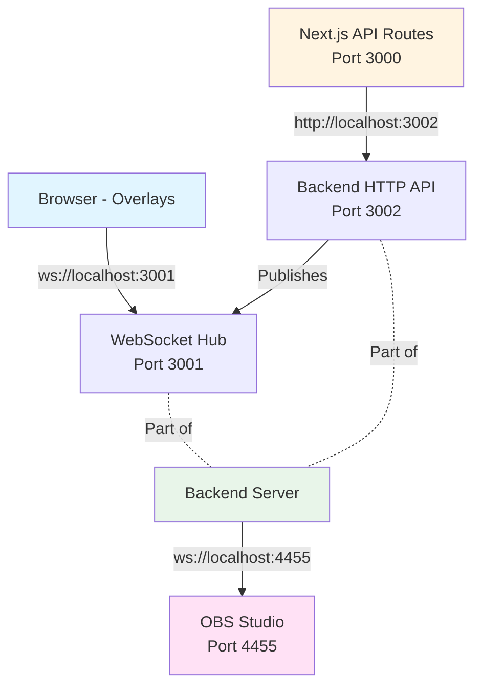

# Final Architecture - Complete Backend Separation

## ✅ Problem Solved

**Issue**: The user correctly identified that the overlays and Next.js API routes were NOT properly separated from the backend services, creating potential for multiple WebSocket connections and singleton issues.

**Solution**: Complete migration to a client-server architecture with proper separation of concerns.

---

## 🏗️ Architecture Layers

### Layer 1: Browser (Client-Side)
- **Overlay Components** (`LowerThirdRenderer`, `CountdownRenderer`, `PosterRenderer`)
- Connect to: `ws://localhost:3001` (WebSocketHub in Backend)
- Purpose: Receive overlay display events

### Layer 2: Next.js (Frontend + API Proxies)
- **Port**: 3000
- **Role**: Frontend UI + API Gateway
- All API routes now **proxy** to backend HTTP API
- **No direct service access** - purely a routing layer

### Layer 3: Standalone Backend Server
- **Ports**:
  - `3001`: WebSocket Hub (for overlay events)
  - `3002`: HTTP API (for Next.js proxies)
- **Services**:
  - `WebSocketHub`: Manages client connections and channels
  - `ChannelManager`: Publishes overlay events
  - `OBSConnectionManager`: Single connection to OBS
  - `DatabaseService`: Shared data access
- **File**: `server/backend.ts`

### Layer 4: OBS Studio
- **Port**: 4455 (default)
- **Protocol**: OBS WebSocket
- Connected to: Backend only (not directly from Next.js or overlays)

---

## 🔄 Data Flow



---

## 📝 Migrated Routes

All Next.js API routes now proxy to backend:

### Overlay Control
- ✅ `/api/overlays/lower` → `BACKEND/api/overlays/lower`
- ✅ `/api/overlays/countdown` → `BACKEND/api/overlays/countdown`
- ✅ `/api/overlays/poster` → `BACKEND/api/overlays/poster`

### Stream Deck Actions
- ✅ `/api/actions/lower/show` → `BACKEND/api/overlays/lower`
- ✅ `/api/actions/lower/hide` → `BACKEND/api/overlays/lower`
- ✅ `/api/actions/countdown/start` → `BACKEND/api/overlays/countdown`

### OBS Control
- ✅ `/api/obs/status` → `BACKEND/api/obs/status`
- ✅ `/api/obs/reconnect` → `BACKEND/api/obs/reconnect`
- ✅ `/api/obs/stream` → `BACKEND/api/obs/stream`
- ✅ `/api/obs/record` → `BACKEND/api/obs/record`

### Debug/Test
- ✅ `/api/debug/websocket` → `BACKEND/ws/stats`
- ✅ `/api/test/lower-third` → `BACKEND/api/overlays/lower`

### Exception
- ⚠️ `/api/init` - Still uses `ServiceEnsurer` (by design - initializes backend in prod)

---

## 🎯 Key Benefits

### 1. **No More Multi-Process Conflicts**
- Only ONE process (backend) manages WebSocket and OBS
- Next.js dev mode can restart without affecting connections

### 2. **True Singleton Behavior**
- Services like `WebSocketHub` and `OBSConnectionManager` are true singletons
- No more "multiple instances" due to process isolation

### 3. **Clean Separation of Concerns**
- Next.js: UI and routing
- Backend: Business logic and external connections
- Clear boundaries and responsibilities

### 4. **Easier Debugging**
- Single source of truth for connections
- Clear logs from backend process
- No confusion about which process handles what

### 5. **Scalability**
- Can deploy backend and frontend separately
- Can scale frontend without affecting backend connections
- Can run multiple Next.js instances sharing one backend

---

## 🚀 Development Workflow

### Start Everything
```bash
pnpm dev
```

This runs concurrently:
- Backend server (port 3001/3002)
- Next.js dev server (port 3000)

### Backend Only
```bash
pnpm run backend
```

### Frontend Only
```bash
pnpm run dev:frontend
```

---

## 🧪 Testing

All 108 tests passing:
- ✅ Component tests (overlays)
- ✅ Service tests
- ✅ Integration tests
- ✅ API tests

Tests mock WebSocket properly with:
- `readyState` tracking
- Proper `close()` implementation
- WebSocket constants (OPEN, CLOSED, etc.)

---

## 📊 Port Map

| Service | Port | Protocol | Purpose |
|---------|------|----------|---------|
| Next.js Frontend | 3000 | HTTP | Web UI |
| WebSocket Hub | 3001 | WebSocket | Overlay events |
| Backend HTTP API | 3002 | HTTP | API for Next.js |
| OBS Studio | 4455 | WebSocket | OBS control |

---

## ✅ Verification

### 1. No Direct Service Access in Next.js
```bash
# Should return 1 file (only /api/init)
grep -r "ChannelManager.getInstance\|WebSocketHub.getInstance\|OBSConnectionManager.getInstance" app/api --include="*.ts"
```

### 2. All Routes Use Backend URL
```bash
# Should find BACKEND_URL in all API routes
grep -r "BACKEND_URL" app/api --include="*.ts"
```

### 3. Tests Pass
```bash
pnpm test
# Test Suites: 12 passed, 12 total
# Tests:       108 passed, 108 total
```

---

## 🎓 Lessons Learned

1. **Overlays are NOT connecting to OBS directly**
   - They connect to WebSocketHub (port 3001)
   - WebSocketHub is part of the backend
   - Only the backend connects to OBS (port 4455)

2. **Next.js dev mode creates multiple processes**
   - Each has its own memory space
   - Singletons are per-process, not global
   - Solution: Separate backend process

3. **Proper proxy pattern**
   - Next.js routes should be thin
   - Just forward requests to backend
   - No business logic in Next.js API routes

---

## 📚 Related Files

- `server/backend.ts` - Main backend server
- `server/api/overlays.ts` - Overlay control routes (backend)
- `server/api/obs.ts` - OBS control routes (backend)
- `lib/utils/BackendClient.ts` - HTTP client for backend (unused now, routes proxy directly)
- `instrumentation.ts` - Conditional initialization (dev vs prod)
- `package.json` - Scripts for `dev`, `dev:backend`, `dev:frontend`

---

**Architecture Status**: ✅ **COMPLETE AND VERIFIED**

