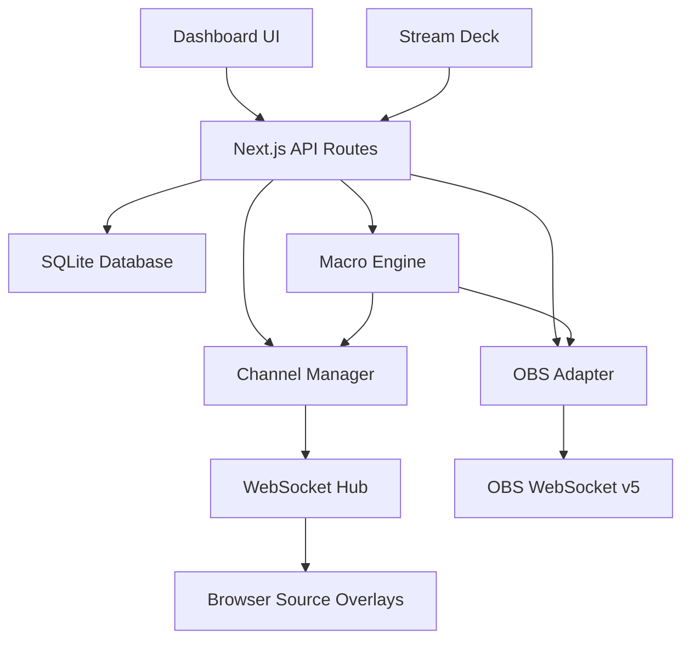

# OBS Live Suite - Architecture

## Overview

OBS Live Suite is a Next.js application for managing live show overlays with real-time control, OBS integration, and Stream Deck support.

## System Architecture



## Core Components

### Frontend Layer
- **Dashboard**: React components for real-time control
- **Overlays**: Browser-source compatible overlay renderers
- **Assets Library**: Manage guests, posters, themes
- **Plugin Updater**: Scan and update OBS plugins

### API Layer
- **Next.js API Routes**: RESTful endpoints
- **Server Actions**: Real-time data mutations
- **WebSocket Upgrade**: Handled separately on port 3003

### Business Logic Layer
- **Managers**: ProfileManager, SettingsManager
- **Services**: DatabaseService, BackupService, StorageService
- **Engines**: MacroEngine for automation
- **Channel Manager**: Pub/sub for overlay events

### Integration Layer
- **OBS Adapter**: Connection, state, scene, and source controllers
- **DSK Service**: Global overlay layer management
- **Plugin Scanner**: Discover installed plugins
- **GitHub Release Checker**: Check for updates

### Data Layer
- **SQLite Database**: Persistent storage (better-sqlite3)
- **File Storage**: Assets in `~/.obs-live-suite/`
- **Models**: Zod-validated data models

## Communication Patterns

### Dashboard ↔ Overlays
1. Dashboard makes HTTP POST to `/api/overlays/{type}`
2. API publishes event to ChannelManager
3. ChannelManager broadcasts via WebSocket
4. Overlays receive event and update display
5. Overlays send acknowledgment back

### Dashboard ↔ OBS
1. Dashboard makes HTTP POST to `/api/obs/{action}`
2. API calls OBS adapter methods
3. Adapter sends commands via obs-websocket
4. OBS state manager tracks changes
5. Dashboard polls `/api/obs/status` for updates

### Stream Deck → Application
1. Stream Deck makes HTTP POST to `/api/actions/{action}`
2. API executes action (overlay, OBS, or macro)
3. Returns success/error status
4. Optional: WebSocket feedback for button states

## Data Flow

### Overlay Display
```
User clicks "Show" → POST /api/overlays/lower → ChannelManager.publish()
→ WebSocket broadcast → Overlay receives → Display animation → Send ACK
```

### Macro Execution
```
User clicks macro → POST /api/actions/macro → MacroEngine.execute()
→ Sequential action execution → Delays between actions → Complete
```

### Plugin Update Check
```
User clicks "Check Updates" → POST /api/updater/check
→ Query registry → Fetch GitHub releases → Compare versions → Update DB
```

## File Structure

```
app/
  api/              # API routes
  dashboard/        # Dashboard page
  overlays/         # Overlay pages
  updater/          # Plugin updater
lib/
  adapters/obs/     # OBS integration
  config/           # Configuration
  models/           # Data models (Zod)
  services/         # Core services
  managers/         # Business logic
  utils/            # Utilities
components/
  dashboard/        # Dashboard components
  overlays/         # Overlay renderers
  ui/               # shadcn/ui components
```

## Key Design Decisions

### Singleton Pattern
Most services use singletons to ensure single instances (database connection, WebSocket hub, OBS connection).

### Event-Driven Architecture
Overlays use pub/sub pattern for loose coupling and real-time updates.

### Modular Design
Each feature is self-contained with clear interfaces for maximum reusability.

### No Server Actions for Real-time
WebSocket used instead of Server Actions for lower latency and better browser source compatibility.

## Performance Considerations

- WebSocket heartbeat every 30s to detect dead connections
- GitHub API caching (1 hour) to avoid rate limits
- Database indexes on frequently queried fields
- Acknowledgment timeout (5s) for overlay events

## Security

- CSRF protection on API endpoints
- Rate limiting on Stream Deck endpoints
- Input validation with Zod
- Optional auth token for LAN mode

## Deployment

- PM2 for process management
- Database auto-initialization
- WebSocket server on separate port (3003)
- OBS connection with auto-reconnect

