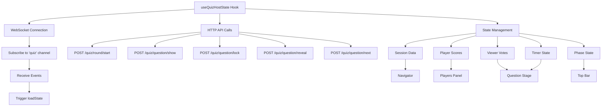

# Quiz Host Interface - Layout Architecture

## Visual Structure

```
┌─────────────────────────────────────────────────────────────────────────────┐
│ Top Bar - Global Controls                                                   │
│ [← Prev] | [Show Question] [Lock Answers] [Reveal Answer] | [Next →]        │
│                                                          Phase: Accepting    │
└─────────────────────────────────────────────────────────────────────────────┘
┌────────────┬──────────────────────────────────────────────┬─────────────────┐
│            │                                              │                 │
│ Navigator  │        Question Stage                        │ Players Panel   │
│            │                                              │                 │
│ Session    │  Round 1 · Q2/5 · [Accepting]                │ Studio Players  │
│ ├─ Round 1 │                                              │ ┌─────────────┐ │
│ │  🟢 Live │  What is the capital of France?              │ │ 👤 Alice    │ │
│ │  ├─ Q1   │  Type: QCM · Points: 1                       │ │ Score: 5    │ │
│ │  ├─ Q2 ✓ │                                              │ └─────────────┘ │
│ │  ├─ Q3   │  ╔══════════════════════════════════════╗    │ ┌─────────────┐ │
│ │  ├─ Q4   │  ║ A. Paris                        65%  ║    │ │ 👤 Bob      │ │
│ │  └─ Q5   │  ║ [████████░░] 130 votes     [👤👤] ║    │ │ Score: 3    │ │
│ │          │  ╚══════════════════════════════════════╝    │ └─────────────┘ │
│ │ [Start]  │                                              │                 │
│ │ [End]    │  ╔══════════════════════════════════════╗    │ Top Viewers     │
│ │          │  ║ B. London                       20%  ║    │ #1 viewer1  10  │
│ ├─ Round 2 │  ║ [██░░░░░░░] 40 votes          [👤] ║    │ #2 viewer2   8  │
│ │  🟡 Not  │  ╚══════════════════════════════════════╝    │ #3 viewer3   6  │
│ │  started │                                              │                 │
│ │  ├─ Q1   │  ╔══════════════════════════════════════╗    │ Viewer Input    │
│ │  └─ Q2   │  ║ C. Berlin                       10%  ║    │ [Accepting ✓]   │
│            │  ║ [█░░░░░░░░] 20 votes              ║    │ ⚡ Active: 190  │
│            │  ╚══════════════════════════════════════╝    │                 │
│            │                                              │ Recent Events   │
│            │  ╔══════════════════════════════════════╗    │ 10:24 Revealed  │
│            │  ║ D. Madrid                        5%  ║    │ 10:23 Locked    │
│            │  ║ [░░░░░░░░░] 10 votes         [👤] ║    │ 10:22 Shown     │
│            │  ╚══════════════════════════════════════╝    │                 │
│            │                                              │                 │
│            │  ⏱️ 00:15 [▶️] [+10s]                         │                 │
│            │  [🔒 Lock] [✅ Reveal] [🗑️ Reset Question]   │                 │
│            │                                              │                 │
└────────────┴──────────────────────────────────────────────┴─────────────────┘
```

## Component Hierarchy

```
QuizHostPage
├── QuizHostTopBar
│   ├── Prev Button
│   ├── Show Button
│   ├── Lock Button
│   ├── Reveal Button
│   ├── Next Button
│   └── Phase Badge
│
├── Layout Container (flex)
│   ├── QuizHostNavigator
│   │   ├── Session Title
│   │   └── Rounds Accordion
│   │       └── Round
│   │           ├── Round Header (status badge)
│   │           ├── Questions List
│   │           │   └── Question (type icon, state badge)
│   │           └── Round Controls
│   │               ├── Start Round Button
│   │               └── End Round Button
│   │
│   ├── QuizQuestionStage
│   │   ├── Header
│   │   │   ├── Round · Question X/Y
│   │   │   └── Phase Badge
│   │   ├── Question Card
│   │   │   ├── Question Text
│   │   │   ├── Type & Points
│   │   │   └── Media (optional)
│   │   ├── QCM Options
│   │   │   └── Option (droppable)
│   │   │       ├── Progress Bar (viewer votes)
│   │   │       ├── Option Text
│   │   │       ├── Vote Stats
│   │   │       └── Player Avatars
│   │   │           └── PlayerAvatarChip (non-draggable)
│   │   └── Footer Controls
│   │       ├── Timer (MM:SS, Start/Stop, +10s)
│   │       ├── Lock Button
│   │       ├── Reveal Button
│   │       └── Reset Button (danger)
│   │
│   └── QuizPlayersPanel
│       ├── Studio Players
│       │   └── Player Card
│       │       ├── PlayerAvatarChip (draggable)
│       │       ├── Name
│       │       └── Score
│       ├── Top Viewers
│       │   └── Viewer (rank, name, score)
│       ├── Viewer Input Toggle
│       │   ├── Accept Button
│       │   └── Active Count
│       └── Event Log
│           └── Event (time, description)
```

## State Flow



## Drag-and-Drop Flow

```mermaid
sequenceDiagram
    participant User
    participant Avatar as PlayerAvatarChip
    participant Option as QCM Option
    participant Handler as onPlayerAssign
    
    User->>Avatar: Start drag
    Avatar->>Avatar: onDragStart (set player ID)
    User->>Option: Drag over
    Option->>Option: onDragOver (show dashed border)
    User->>Option: Drop
    Option->>Option: onDrop (get player ID)
    Option->>Handler: Call with (playerId, optionKey)
    Handler->>Handler: Update playerChoices state
    Option->>Option: Render avatar chip
```

## Color Coding System

### Question Types
| Type | Color | Usage |
|------|-------|-------|
| QCM | Blue 🔵 | Text-based multiple choice |
| Image | Green 🟢 | Image-based questions |
| Closest | Orange 🟠 | Numeric guess questions |
| Open | Purple 🟣 | Free text answers |

### Phase States
| Phase | Color | Badge |
|-------|-------|-------|
| Idle | Gray | Idle |
| Accepting | Green | Accepting |
| Locked | Yellow | Locked |
| Revealed | Blue | Revealed |

### Round States
| State | Color | Badge |
|-------|-------|-------|
| Not started | Yellow 🟡 | Not started |
| Live | Green 🟢 | Live |
| Done | Gray ⚪ | Done |

## Responsive Breakpoints

- **Left Sidebar**: Fixed 320px width
- **Right Panel**: Fixed 320px width
- **Center Stage**: Flex 1 (fills remaining space)
- **Minimum Total**: 1024px recommended

## Accessibility Features

### Keyboard Navigation
- Tab navigation between interactive elements
- Keyboard shortcuts for common actions
- Focus indicators on all buttons
- ARIA labels on icon buttons

### Drag-and-Drop Alternatives
- TODO: Click avatar → click option (future)
- TODO: Quick assign buttons (A/B/C/D)

### Visual Indicators
- High contrast phase badges
- Color + text for all states (not color alone)
- Timer red warning at <10s
- Clear visual feedback on all interactions

---

*Last updated: October 2025*

